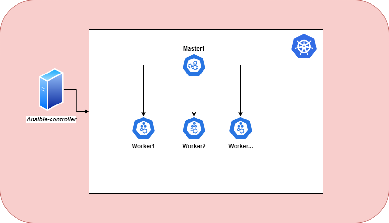

# Architecture


## Requirements
- 1 node ansible-controller RAM 2G
- 1 node master RAM 2G
- 2 node worker RAM 1.5G

```
vagrant up # start VMs
vagrant halt # shutdown VMs
vagrant destroy # Destroy VMs
```